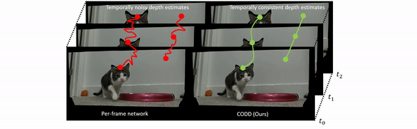

# Temporally Consistent Online Depth Estimation in Dynamic Scenes

### [Project Page](https://mli0603.github.io/codd/) | [Paper](https://arxiv.org/abs/2111.09337)

This is the official repo for our
work [Temporally Consistent Online Depth Estimation in Dynamic Scenes](https://arxiv.org/abs/2111.09337) accepted at
WACV 2023.



If you find CODD relevant, please cite

```
@article{li2021temporally,
  title={Temporally Consistent Online Depth Estimation in Dynamic Scenes},
  author={Li, Zhaoshuo and Ye, Wei and Wang, Dilin and Creighton, Francis X and Taylor, Russell H and Venkatesh, Ganesh and Unberath, Mathias},
   journal={IEEE/CVF Winter Conference on Applications of Computer Vision (WACV)},
   year={2023}
}
```

## Environment Setup

CODD is based on several excellent open-sourced libraries

- [pytorch >= 1.9.0](https://pytorch.org/get-started/locally/)
- [pytorch3d]()
- [lietorch](https://github.com/princeton-vl/lietorch)
- [mmcv == 1.7.0](https://mmcv.readthedocs.io/en/v1.7.0/get_started/installation.html#install-mmcv-full)
- [mmseg](https://github.com/open-mmlab/mmsegmentation)

Example setup commands (tested on Ubuntu 20.04 and 22.04)

```bash
conda create --name codd python=3.8 -y
conda activate codd
pip install scipy pyyaml terminaltables natsort
pip install torch==1.12.1+cu113 torchvision==0.13.1+cu113 torchaudio==0.12.1 --extra-index-url https://download.pytorch.org/whl/cu113 # pytorch
pip install --no-index --no-cache-dir pytorch3d -f https://dl.fbaipublicfiles.com/pytorch3d/packaging/wheels/py38_cu113_pyt1121/download.html # pytorch3d
pip install mmcv-full==1.7.0 -f https://download.openmmlab.com/mmcv/dist/cu113/torch1.12/index.html # mmcv
pip install mmsegmentation # mmseg
pip install git+https://github.com/princeton-vl/lietorch.git # lietorch -- this will take a while
```

## Pretrained Weights

- [FlyingThigns3D trained model](https://drive.google.com/file/d/1OH2snX1kajNpp15UVkZEMZwV7Ndzndot/view?usp=sharing)
- [TartanAir trained model](https://drive.google.com/file/d/1kgMojOY8xlVaSLKOgX1cRFP05yh0OneQ/view?usp=sharing)
- [KITTI Depth trained model](https://drive.google.com/file/d/16WM4YgpB7PiNkssXvTnWJerM3Z22HLBR/view?usp=sharinghttps://drive.google.com/file/d/16WM4YgpB7PiNkssXvTnWJerM3Z22HLBR/view?usp=sharing)
- [Demo](https://drive.google.com/file/d/1Qzmav_SG58JG-rz_nKqagh2Ps9peFPK_/view?usp=sharing)

## Dataset Used

- [FlyingThings3D](https://lmb.informatik.uni-freiburg.de/resources/datasets/SceneFlowDatasets.en.html)
- [KITTI Depth](https://www.cvlibs.net/datasets/kitti/eval_depth.php?benchmark=depth_prediction)
- [KITTI 2015](https://www.cvlibs.net/datasets/kitti/eval_scene_flow.php)
- [TartanAir](https://theairlab.org/tartanair-dataset/)

## Configuration

For more details and examples, please see `configs` folder.

### Network

In CODD, you can configure your model in a modular manner. The network is often specified in the following way:

```python
model = dict(
    type='ConsistentOnlineDynamicDepth',
    stereo=dict(
        type='HITNetMF',  # enter your choice of stereo network
        ...  # model specific configs
    ),
    motion=dict(
        type="Motion",  # enter your choice of motion network
        ...  # model specific configs
    ),
    fusion=dict(
        type="Fusion",  # enter your choice of fusion network
        ...  # model specific configs
    )
)
```

If only `stereo` network is needed, you can simply comment out the `motion` and `fusion` network.
You can also swap out the individual networks with your own implementation.

### Dataset

In each dataset config, there are several things to be specified.

- `data_root`: path to stereo data.
    - For FlyingThings3D dataset, the data are downloaded individually. So `data_root` is the path to RGB images.
      Additionally specify `disp_root`, path to disparity data; `flow_root`, path to optical flow data;
      and `disp_change_root`, path to disparity change data.
- `train_split`, `val_split`, `test_split`: path to split files. Please see section `Others - Split Files` below for
  more details.

The rest of the variables are already set but feel free to adjust if you want to customize.

- `batch_size`: training batch size.
- `crop_size`: training crop size
- `num_frames`: the number of frames to run. For training, CODD uses 2 frames. For inference, CODD runs on the entire
  sequence `num_frames=-1`
- `calib`: focal length * baseline
- `disp_range`: range of disparity
- `intrinsics`: fx, fy, cx, cy

### Train/Inference

The training config is of the following format

```python
_base_ = [
    'PATH_TO_MODEL_CONFIG', 'PATH_TO_DATA_CONFIG',
    'default_runtime.py', 'PATH_TO_SCHEDULE_CONFIG'
]
```

Modify `configs/train_config.py` for desirable model and dataset config

The inference config is of the following format

```python
_base_ = [
    'PATH_TO_MODEL_CONFIG', 'PATH_TO_DATA_CONFIG',
    'default_runtime.py'
]
```

Modify `configs/inference.py` for desirable model and dataset config

## Training

- CODD uses a three stage training strategy on FlyingThings3D
    - Training stereo
    - Training motion
    - Training fusion
- The pretrained model is then fine-tuned on other datasets.
- Modify `configs/train_config.py` for desirable model and dataset config
- Run following command
    - Distributed
        ```angular2html
        ./scripts/train.sh configs/train_config.py NUM_GPUS --work-dir PATH_TO_LOG
        ```
    - Single GPU
      ```angular2html
      python train.py configs/train_config.py NUM_GPUS --work-dir PATH_TO_LOG
      ```

## Inference

There are two inference modes

- Evaluate `--eval`: compute metrics and save results
- Show `--show`: save disparity estimates
    - when running with `custom_data`, provide path to left and right images using `--img-dir` and `--r-img-dir`

To run inference

- Modify `configs/inference_config.py` for model and dataset config
- Run following command
    - Distributed
        ```angular2html
        ./scripts/inference.sh configs/inference_config.py CHECKPOINT_PATH NUM_GPUS [optional arguments]
        ```
    - Single GPU
        ```angular2html
        python inference.py configs/inference_config.py CHECKPOINT_PATH NUM_GPUS [optional arguments]
        ```

Optional arguments:

- `--work-dir`: logging directory
- `--num-frames`: number of frames to inference on, `-1` for all frames

## Others

### Split Files

The split file is stored in the following format

```yaml
LEFT_IMAGE RIGHT_IMAGE DISPARITY_IMAGE OPTICAL_FLOW DISPARITY_CHANGE OPTICAL_FLOW_OCCLUSION DISPARITY_FRAME2_in_FRAME1 DISPARITY_OCCLUSION
```

The split files can be generated by using `utils/generate_split_files.py`.

- For datasets (TartanAir and Sintel) without ground truth disparity change, I use `OPTICAL_FLOW` to warp the next frame
  disparity into current frame and compute the change myself. However, not all regions are valid due to flow occlusion.
  Therefore, for such computation, `OPTICAL_FLOW_OCCLUSION` must be provided.
- For datasets (KITTI Depth) without ground truth optical flow, I used RAFT to estimate the optical flow information.
  The disparity of the next frame is stored as `DISPARITY_FRAME2_in_FRAME1` following KITTI convention. 
- To generate disparity from the ground truth lidar point cloud, please refer to [pykitti](https://github.com/utiasSTARS/pykitti).
- When a specific type of data is not provided, `None` is used to skip reading. Please
  see `datasets/custom_stereo_mf.py` for more details of how data is parsed.

### Visualize Point Cloud
To visualize the 3D point cloud generated from depth map, the script `utils/vis_point_cloud.py` can be used.

### Benchmark Speed
To benchmark speed, run the following command

```angular2html
python benchmark.py configs/models/codd.py
```

## Disclaimer

The majority of CODD is licensed under CC-BY-NC, however portions of the project are available under separate license
terms: https://github.com/princeton-vl/RAFT-3D is licensed under the BSD-3-Clause license.